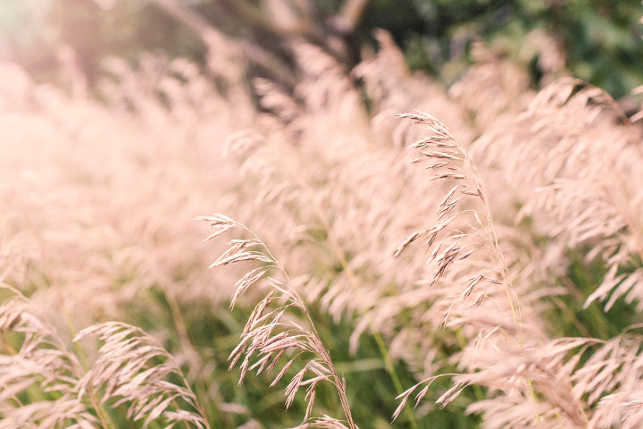
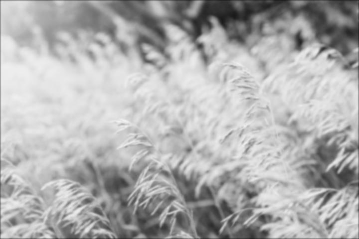
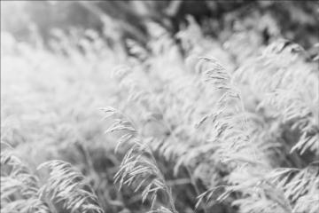
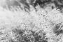
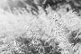

# pyvisionfilters
Linear and non-linear filters for simple computer vision tasks

#### visionfilters.py

```python
# Return a box filter of size n by n
# Requires n to be an odd integer
boxfilter(n)

# Return a normalized 1D Gaussian filter
# Fix length of filter array to (6 * sigma) rounded up to the next odd integer
gauss1d(sigma)

# Return a 2D Gaussian filter
# Fix side lengths to (6 * sigma) rounded up to next odd integer
gauss2d(sigma)

# Return the result of applying a 2D Gaussian filter convolution to an input array
gaussconvolve2d(array, sigma)
```

#### blurexample.py

Demonstrates applying visionfilters.gaussconvolve2d() to blur an image.

Our starting file is a colour image.  See Gratisography for the [full-size photograph](http://www.gratisography.com/pictures/324_1.jpg).


For simplicity, we convert the image to grayscale so that it can be represented as a matrix of light intensity values.

```python
from PIL import Image
import numpy as np
import visionfilters

# Original image from http://www.gratisography.com/pictures/324_1.jpg
img = Image.open('images/wheat.jpg')

# Convert image to grayscale
img = img.convert('L')
img.save('images/output/wheat_grayscale.jpg', 'JPEG')
```


Applying a 2D Gaussian filter convolution results blurs the image, with increasing sigma values resulting in further blurring.

```python
# Convert image to an array to apply the filter convolution
imgArray = np.asarray(img)
blurredImgArray = visionfilters.gaussconvolve2d(imgArray, sigma=1.5)

# Convert to uint8, then to an Image
blurredImg = Image.fromarray(blurredImgArray.astype('uint8'))
blurredImg.save('images/output/wheat_grayscale_blurred.jpg', 'JPEG')
```



#### shrinkexample.py

The Gaussian filter is often used to pre-process images before shrinking.  Smoothing removes a great deal of the graininess that would otherwise result from just taking every nth pixel of the original image.

The following code generates a grayscale image scaled down in size by powers of 2.

```python
from PIL import Image
import numpy as np
import visionfilters

def shrinkWithSmoothing(imgArray, scalingFactor, sigma):
  # Smooth with a 2D Gaussian filter before subsampling to minimize artifacts
  smoothedImgArray = visionfilters.gaussconvolve2d(imgArray, sigma)
  # Sample every (2^scalingFactor)-th pixel to obtain a smaller image
  resizedImgArray = np.array([row[0::pow(2,scalingFactor)] for row in smoothedImgArray[0::pow(2,scalingFactor)]])
  return Image.fromarray(resizedImgArray.astype('uint8'))
```

  

Compare this to resizing the images without pre-filtering:

  

### Disclaimer

These filters were written for educational purposes as part of an undergraduate course on computer vision, and are not intended for general use.

There are a number of excellent Python libraries available that are optimized for otherwise computationally expensive tasks, such as [SciPy](https://docs.scipy.org/doc/scipy/reference/index.html) and [NumPy](https://docs.scipy.org/doc/numpy-dev/user/quickstart.html).
